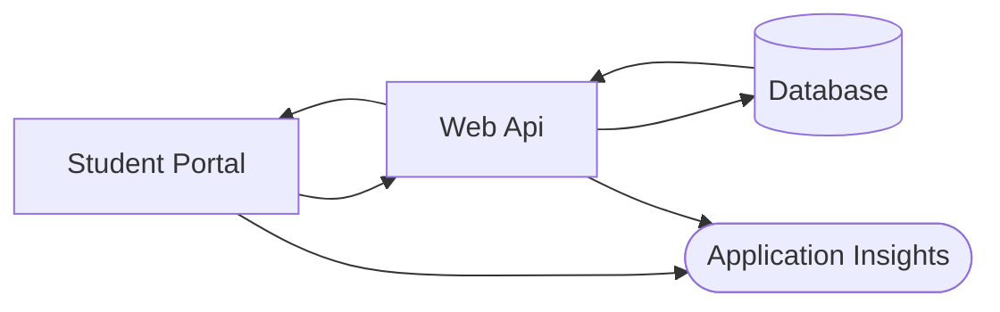
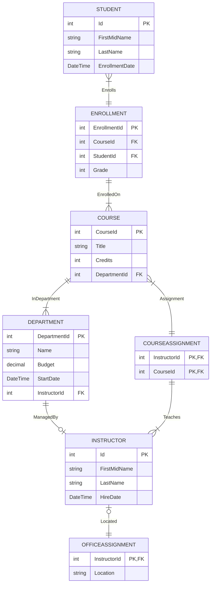

# TFL-DevOps-Test

## Scenario
You are part of a team providing level 2 and level 3 support to a school management system.
The system consists of an Azure SQL database, A Web Api and a Web Portal to look up a Student Record.

Below is a simple architecture diagram of the system.

Below is a Entity Relationship diagram for the database

## Question 1
An incident has been raised informing you that the Web Api appears to be unavailable. You've been tasked with diagnosing and fixing the issue.
Can you diagnose the failure in the system?
Once identified can you provide an appropiate fix and if required deploy it?
Can you test your fix has resolved the issue?

## Question 2
A production bug has been raised for the StudentPortal and assigned to your team. You've been tasked with diagnosing and fixing the code.
Can you diagnose the error in the code?
Once identified can you provide an appropiate fix and deploy it?
Can you verify the code now works as expected?
Are there ways for you to identify these issues ahead of time?

### Bug
#### Description
On the Student Data page the total number of credits for the student is showing an incorrect value
#### Repro Steps
1. Access the Student Portal site
2. Enter the follow details in the form
    FirstName: Carson
    LastName: Alexander
3. Submit the form
4. On the Data page the total number of credits is showing as 3, when the total should be 9.

## Question 3
Your team are responsible for managing the Bulk upload of the new Students each year.
This process is typically done with a CSV file and Powershell script. You've attempted to run the script to do the data upload but the script has failed.
Can you diagnose why the script is failing?
Can you fix the script and demonstrate it working?
